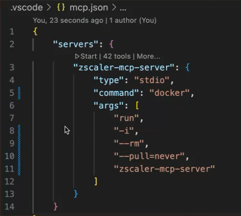

# ⭐ MCP Server for the Zscaler API

This project defines the **local** Zscaler MCP server, enabling you to perform a wide range of tasks directly from your code editor.

> 🚨 **Public Preview:** This project is in public preview. You can expect that the tools will change before general availability.

## 📄 Table of contents

1. [📺 Overview](#-overview)
2. [⚙️ Supported tools](#️-supported-tools)
3. [🔌 Installation & getting started](#-installation--getting-started)
4. [🔦 Usage](#-using-the-mcp-server-with-agents)
5. [📝 Troubleshooting](#-troubleshooting)

## 📺 Overview

The Zscaler MCP Server brings context to your agents. Try prompts like:

- "List my ZPA Application segments"
- "List my ZPA Segment Groups"
- "List my ZIA Rule Labels"

## ⚙️ Supported tools

### ZCC Features

- **zcc_list_devices**: Retrieves ZCC device enrollment information from the Zscaler Client Connector Portal
- **zcc_devices_csv_exporter**: Downloads ZCC device information or service status as a CSV file

### ZDX Features

- **zdx_list_administration**: Retrieves ZCC device enrollment information from the Zscaler Client Connector Portal
- **zdx_list_active_devices**: Downloads ZCC device information or service status as a CSV file.

### ZIA Features

- **zia_activation**: Activate ZIA configuration changes
- **zia_atp_malicious_urls**: Manages the malicious URL denylist in the ZIA Advanced Threat Protection (ATP) policy
- **zia_auth_exempt_urls**: Manages the list of cookie authentication exempt URLs in ZIA.
- **zia_rule_labels**: Tool for managing ZIA Rule Labels via the Python SDK
- **zia_cloud_firewall_rule**: Tool for managing ZIA Cloud Firewall Rules
- **zia_ip_source_group**: Tool for managing ZIA IP Source Groups
- **zia_ip_destination_groups**: Tool for managing ZIA IP Destination Groups
- **zia_network_app_group**: Tool for managing ZIA Network Application Groups
- **zia_location_management**: Tool for managing ZIA Locations
- **zia_vpn_credentials**: Tool for managing ZIA VPN Credentials
- **zia_static_ips**: Tool for managing ZIA Static IP addresses
- **zia_gre_tunnels**: Tool for managing ZIA GRE Tunnels and associated static IPs
- **zia_geo_search**: Retrieves the list of cities (along with their geographical data) that match the prefix search
- **zia_gre_range_discovery**: Retrieves available GRE internal IP ranges in ZIA
- **zia_sandbox**: Retrieves ZIA Sandbox information i.e Quota, MD5 File Hashes

### ZPA Features

- **zpa_application_segments**: Tool for managing Application Segments
- **zpa_app_segments_by_type**: Retrieves application segments by type i.e `SECURE_REMOTE_ACCESS`, `INSPECT`, `BROWSER_ACCESS`
- **zpa_application_servers**: Tool for managing Application Servers
- **zpa_ba_certificates**: Tool for managing Browser Access (BA) Certificates
- **zpa_segment_groups**: Tool for managing segment groups
- **zpa_server_groups**: Tool for managing server groups
- **zpa_app_connector_groups**: Tool for managing app connector groups
- **zpa_service_edge_groups**: Tool for managing app service edge group
- **zpa_access_policy**: Tool for managing access policy
- **zpa_forwarding_policy**: Tool for managing Client Forwarding Policy Rules
- **zpa_timeout_policy**: Tool for managing Timeout Policy Rules
- **zpa_isolation_policy**: Tool for managing Isolation Policy Rules
- **zpa_isolation_profile**: Retrieves Cloud Browser Isolation Profiles
- **zpa_app_protection_profiles**: Retrieves App Protection Profiles
- **zpa_enrollment_certificates**: Retrieves Enrollment Certificates
- **zpa_provisioning_key**: Tool for managing Provisioning Keys
- **zpa_pra_portals**: Tool for managing Privileged Remote Access (PRA) Portals
- **zpa_pra_credentials**: Tool for managing Privileged Remote Access (PRA) Credentials
- **zpa_scim_groups**: Retrieves SCIM groups under a given Identity Provider (IdP)
- **zpa_scim_attributes**: Retrieves SCIM Attributes
- **zpa_saml_attributes**: Retrieves SAML Attributes
- **zpa_posture_profiles**: Retrieves Posture Profiles
- **zpa_trusted_networks**: Retrieves Trusted Networks

## 🔌 Installation & getting started

Clone the repository, install dependencies, and add it to your MCP client configuration.

### Supported Agents

- [Claude](https://claude.ai/)
- [Cursor](https://cursor.so/)
- [VS Code](https://code.visualstudio.com/download) or [VS Code Insiders](https://code.visualstudio.com/insiders)

## Zscaler OneAPI Login

The Zscaler MCP Server supports Zscaler's OneAPI authentication as the default and preferred method.

Create a `.env` file in your project root with the following:

```env
ZSCALER_CLIENT_ID=your_client_id
ZSCALER_CLIENT_SECRET=your_client_secret
ZSCALER_CUSTOMER_ID=your_customer_id
ZSCALER_VANITY_DOMAIN=your_vanity_domain
ZSCALER_CLOUD=beta
```

⚠️ Do not commit `.env` to source control. Add it to your `.gitignore`.

You can provide credentials via the `ZSCALER_CLIENT_ID`, `ZSCALER_CLIENT_SECRET`, `ZSCALER_VANITY_DOMAIN`, `ZSCALER_CLOUD` environment variables, representing your Zidentity OneAPI credentials `clientId`, `clientSecret`, `vanityDomain` and `cloud` respectively.

| Argument     | Description | Environment variable |
|--------------|-------------|-------------------|
| `clientId`       | _(String)_ Zscaler API Client ID, used with `clientSecret` or `PrivateKey` OAuth auth mode.| `ZSCALER_CLIENT_ID` |
| `clientSecret`       | _(String)_ A string that contains the password for the API admin.|
| `vanityDomain`       | _(String)_ Refers to the domain name used by your organization i.e `acme` | `ZSCALER_VANITY_DOMAIN` |
| `cloud`       | _(String)_ The Zidentity cloud to authenticate to i.e `beta`| `ZSCALER_CLOUD` |

## Zscaler Legacy API Login

### ZIA Legacy Authentication

You can provide credentials via the `ZIA_USERNAME`, `ZIA_PASSWORD`, `ZIA_API_KEY`, `ZIA_CLOUD` environment variables, representing your ZIA `username`, `password`, `api_key` and `cloud` respectively.

```env
ZIA_USERNAME=username
ZIA_PASSWORD=password
ZIA_API_KEY=api_key
ZIA_CLOUD=cloud
```

⚠️ Do not commit `.env` to source control. Add it to your `.gitignore`.

| Argument     | Description | Environment variable |
|--------------|-------------|-------------------|
| `username`       | _(String)_ A string that contains the email ID of the API admin.| `ZIA_USERNAME` |
| `password`       | _(String)_ A string that contains the password for the API admin.| `ZIA_PASSWORD` |
| `api_key`       | _(String)_ A string that contains the obfuscated API key (i.e., the return value of the obfuscateApiKey() method).| `ZIA_API_KEY` |
| `cloud`       | _(String)_ The cloud name to authenticate to i.e `zscalertwo`| `ZIA_CLOUD` |

The following cloud environments are supported:

- `zscaler`
- `zscalerone`
- `zscalertwo`
- `zscalerthree`
- `zscloud`
- `zscalerbeta`
- `zscalergov`
- `zscalerten`
- `zspreview`

### ZPA Legacy Authentication

You can provide credentials via the `ZPA_CLIENT_ID`, `ZPA_CLIENT_SECRET`, `ZPA_CUSTOMER_ID`, `ZPA_CLOUD` environment variables, representing your ZPA `clientId`, `clientSecret`, `customerId` and `cloud` of your ZPA account, respectively.

```env
ZPA_CLIENT_ID=client_id
ZPA_CLIENT_SECRET=client_secret
ZPA_CUSTOMER_ID=customer_id
ZPA_CLOUD=cloud
```

⚠️ Do not commit `.env` to source control. Add it to your `.gitignore`.

| Argument     | Description | Environment variable |
|--------------|-------------|-------------------|
| `clientId`       | _(String)_ The ZPA API client ID generated from the ZPA console.| `ZPA_CLIENT_ID` |
| `clientSecret`       | _(String)_ The ZPA API client secret generated from the ZPA console.| `ZPA_CLIENT_SECRET` |
| `customerId`       | _(String)_ The ZPA tenant ID found in the Administration > Company menu in the ZPA console.| `ZPA_CUSTOMER_ID` |
| `microtenantId`       | _(String)_ The ZPA microtenant ID found in the respective microtenant instance under Configuration & Control > Public API > API Keys menu in the ZPA console.| `ZPA_MICROTENANT_ID` |
| `cloud`       | _(String)_ The Zscaler cloud for your tenancy.| `ZPA_CLOUD` |

### ZCC Legacy Authentication

You can provide credentials via the `ZCC_CLIENT_ID`, `ZCC_CLIENT_SECRET`, `ZCC_CLOUD` environment variables, representing your ZIA `api_key`, `secret_key`, and `cloud` respectively.

~> **NOTE** `ZCC_CLOUD` environment variable is required, and is used to identify the correct API gateway where the API requests should be forwarded to.

```env
ZCC_CLIENT_ID=api_key
ZCC_CLIENT_SECRET=secret_key
ZCC_CLOUD=cloud
```

⚠️ Do not commit `.env` to source control. Add it to your `.gitignore`.

| Argument     | Description | Environment variable |
|--------------|-------------|-------------------|
| `api_key`       | _(String)_ A string that contains the apiKey for the Mobile Portal.| `ZCC_CLIENT_ID` |
| `secret_key`       | _(String)_ A string that contains the secret key for the Mobile Portal.| `ZCC_CLIENT_SECRET` |
| `cloud`       | _(String)_ The cloud name to authenticate to i.e `zscalertwo`| `ZCC_CLOUD` |

The following cloud environments are supported:

- `zscaler`
- `zscalerone`
- `zscalertwo`
- `zscalerthree`
- `zscloud`
- `zscalerbeta`
- `zscalergov`
- `zscalerten`
- `zspreview`

### ZDX Legacy Authentication

You can provide credentials via the `ZDX_CLIENT_ID`, `ZDX_CLIENT_SECRET` environment variables, representing your ZDX `key_id`, `key_secret` of your ZDX account, respectively.

```env
ZDX_CLIENT_ID=api_key
ZDX_CLIENT_SECRET=secret_key
ZDX_CLOUD=cloud
```

⚠️ Do not commit `.env` to source control. Add it to your `.gitignore`.

| Argument     | Description | Environment variable |
|--------------|-------------|-------------------|
| `key_id`       | _(String)_ A string that contains the key_id for the ZDX Portal.| `ZDX_CLIENT_ID` |
| `key_secret`       | _(String)_ A string that contains the key_secret key for the ZDX Portal.| `ZDX_CLIENT_SECRET` |
| `cloud`            | _(String)_ The cloud name prefix that identifies the correct API endpoint.| `ZDX_CLOUD` |

### 🐳 Run Zscaler MCP Server with Docker

For the most reliable and portable experience, use Docker to run the MCP server. This setup ensures environment variables are injected properly and isolates dependencies from your system.

#### ✅ Prerequisites

1. Install [Docker Desktop](https://www.docker.com/products/docker-desktop)
2. Create a `.env` file in the root of your project with your Zscaler credentials (see [OneAPI Login](#zscaler-oneapi-login)):

```env
ZSCALER_CLIENT_ID=your_client_id
ZSCALER_CLIENT_SECRET=your_client_secret
ZSCALER_CUSTOMER_ID=your_customer_id
ZSCALER_VANITY_DOMAIN=your_vanity_domain
ZSCALER_CLOUD=beta
```

⚠️ Do not commit this file. Add .env to your .gitignore.

#### 🧨 Installing Zscaler MCP Server Container (Locally)

1. Run the command `make docker-build`

2. In your project, add a `.vscode\mcp.json` file and add the following:

   ``` json
    {
        "servers": {
            "zscaler-mcp-server": {
                "type": "stdio",
                "command": "docker",
                "args": [
                    "run",
                    "-i",
                    "--rm",
                    "--pull=never",
                    "zscaler-mcp-server"
                ]
            }
        }
    }
   ```

3. Save the file and click `Start`

   

```sh
[MCP] Environment check:
  ZSCALER_CLIENT_ID set: True
  ...
🚀 MCP Server starting...
```

✅ The container now runs in stdio mode and automatically loads your credentials from `.env`.

#### 🛠️ Installing from source (dev mode)

This method is ideal for developers working on new tools or contributing to the MCP server.

1. Clone the repository.
2. Install dependencies:

```sh
uv pip install -e .
```

3. Edit or add `.vscode/mcp.json`:

   ``` json
    {
    "servers": {
        "zscaler-mcp-server": {
        "type": "stdio",
        "command": "python",
        "args": [
            "-m",
            "zscaler_mcp_server"
        ]
        }
    }
    }
    ```

4. Save the file and click `Start`

   

## 🔦 Using the MCP Server with Agents

Once your server is running (via Docker or source), you can access its tools through AI-integrated editors or platforms.

### 🧠 Claude

1. Open Claude
2. In Chat, select the "Search & Tools"
3. The server appears in the tools list `zscaler-mcp-server`
4. Try prompts like "List ZPA Segment Groups" or "List ZIA Rule Labels"
5. Select the tool and click "Submit"

### 💻 Cursor

1. Open Cursor, then settings
2. In Curos Settings, select "Tools & Integrations"
3. In the MCP Tools section, turn on `zscaler-mcp-server`
4. Select `View` and `Command Palette` and `Chat: Open Chat Agent`
5. In chat, switch to [Agent Mode](https://docs.cursor.com/chat/agent).
6. Try prompts like "List ZPA Segment Groups" or "List ZIA Rule Labels"
7. Click "Submit"

### Visual Studio Code + GitHub Copilot

Install

After installation, select GitHub Copilot Agent Mode and refresh the tools list. Learn more about Agent Mode in the [VS Code Documentation](https://code.visualstudio.com/docs/copilot/chat/chat-agent-mode).

1. Open VS Code and launch GitHub Copilot
2. Switch to Agent Mode (via the gear menu)
3. Start the MCP Server
4. Refresh the tools list
5. Try a prompt like: `Create a ZPA segment group named "DevServices"`

📚 Learn more about Agent Mode in the [VS Code Copilot documentation](https://code.visualstudio.com/docs/copilot/chat/chat-agent-mode)

## 📝 Troubleshooting

See the [Troubleshooting guide](./docs/TROUBLESHOOTING.md) for help with common issues and logging.