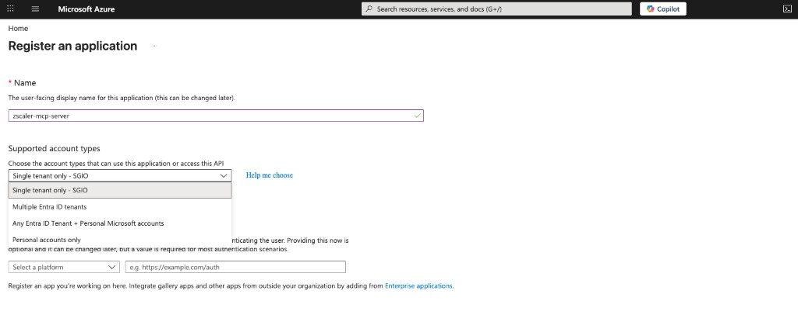
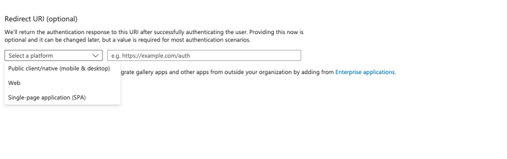
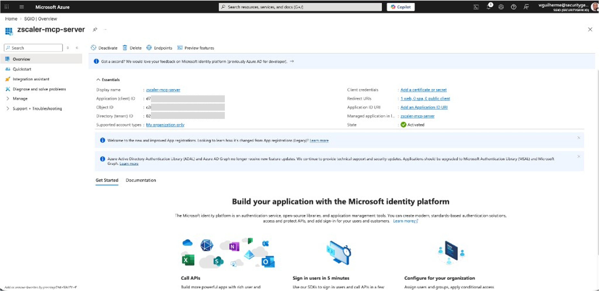
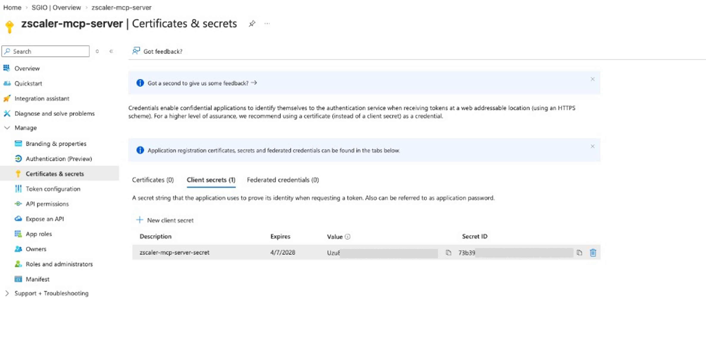
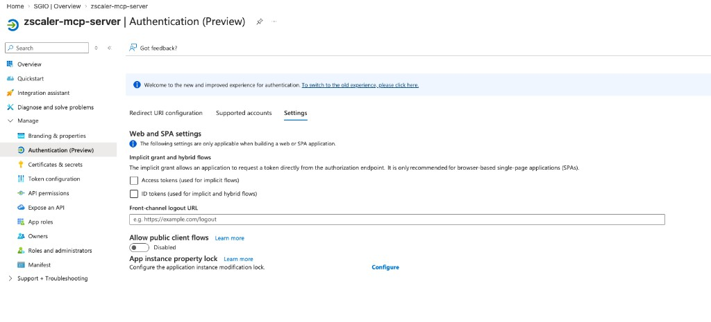
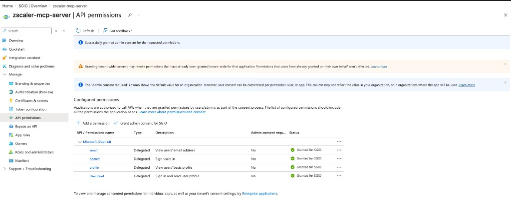
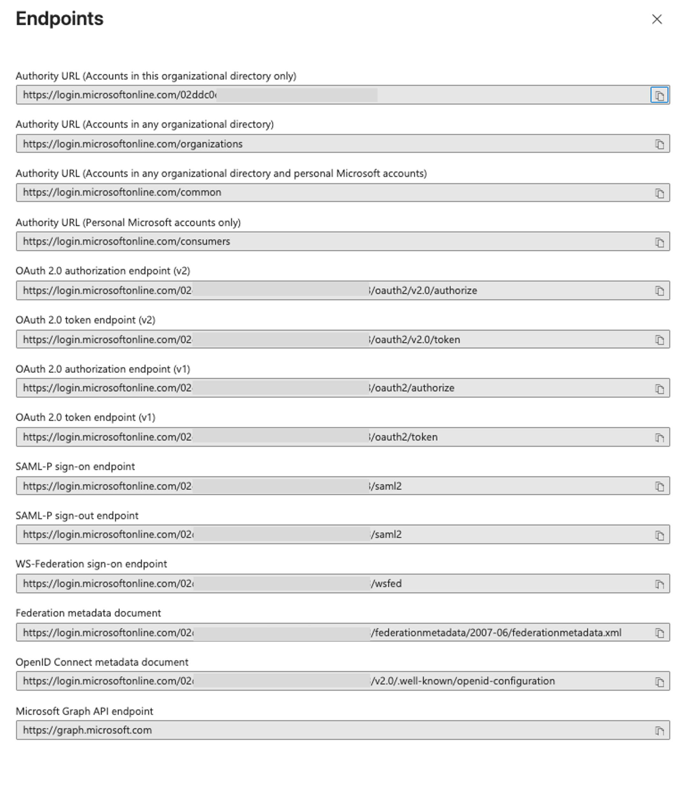

# OIDCProxy Setup with Microsoft Entra ID

This guide walks you through configuring **Microsoft Entra ID** (formerly Azure AD) as the identity provider for the Zscaler MCP Server's OIDCProxy authentication mode. When complete, users will authenticate via their Microsoft account before accessing Zscaler MCP tools.

## Overview

OIDCProxy uses OAuth 2.1 with Dynamic Client Registration (DCR) to authenticate MCP clients. The flow works as follows:

1. User opens Claude Desktop / Cursor
2. `mcp-remote` discovers the server's OAuth endpoints
3. A browser window opens with the Microsoft Entra ID sign-in page
4. User authenticates with their Microsoft account
5. Entra ID issues tokens; the MCP server validates them
6. The MCP client is authenticated and can call Zscaler tools

This is the same OIDCProxy mechanism used with Auth0, Okta, Keycloak, or any OIDC-compliant provider — only the configuration differs.

## Prerequisites

- **Azure subscription** with access to Microsoft Entra ID
- **Global Administrator** or **Application Administrator** role (to create app registrations and grant admin consent)
- **Zscaler MCP Server** source code or installed package
- **Node.js** (for `npx mcp-remote`)

## Step 1: Create an App Registration

1. Go to the [Azure Portal](https://portal.azure.com)
2. Navigate to **Microsoft Entra ID** → **App registrations** → **+ New registration**

   

3. Fill in the registration form:

   | Field | Value |
   |-------|-------|
   | **Name** | `zscaler-mcp-server` |
   | **Supported account types** | "Accounts in this organizational directory only" (single tenant) |

4. Under **Redirect URI**:
   - **Platform**: Select **Web**
   - **URI**: Enter `http://localhost:8000/auth/callback`

   

5. Click **Register**

> **Note:** For remote deployments (Azure VM, Container Apps), add additional redirect URIs later:
> `http://<PUBLIC_IP>:8000/auth/callback` or `https://<FQDN>/auth/callback`

## Step 2: Note Your Application IDs

After registration, you'll land on the app's **Overview** page:



Note down these two values:

| Field | Example |
|-------|---------|
| **Application (client) ID** | `00000000-1111-2222-3333-444444444444` |
| **Directory (tenant) ID** | `00000000-1111-2222-3333-444444444444` |

You can also find your tenant ID via the Azure CLI:

```bash
az account show --query tenantId -o tsv
```

## Step 3: Create a Client Secret

1. In your app registration, go to **Certificates & secrets** → **Client secrets** → **+ New client secret**
2. **Description**: `zscaler-mcp-server-secret`
3. **Expires**: Choose your preference (6, 12, or 24 months)
4. Click **Add**



> **Important:** Copy the **Value** column immediately — it is only shown once. If you navigate away, you cannot retrieve it.

## Step 4: Enable ID Tokens

1. Go to **Authentication (Preview)** in the left sidebar
2. Click the **Settings** tab
3. Under **Implicit grant and hybrid flows**, check: **ID tokens (used for implicit and hybrid flows)**
4. Click **Save**



## Step 5: Configure API Permissions

1. Go to **API permissions** in the left sidebar
2. Click **+ Add a permission** → **Microsoft Graph** → **Delegated permissions**
3. Search and add:
   - `openid`
   - `profile`
   - `email`
4. Click **Add permissions**
5. Click **Grant admin consent for [your organization]**



All four permissions (`User.Read`, `openid`, `profile`, `email`) should show green checkmarks under the **Status** column.

## Step 6: Verify Endpoints

Click **Endpoints** in the top bar of your app registration to view the OIDC endpoints:



The key URL you need is the **OpenID Connect metadata document**:

```text
https://login.microsoftonline.com/{tenant-id}/v2.0/.well-known/openid-configuration
```

You can verify it works:

```bash
curl -s "https://login.microsoftonline.com/{tenant-id}/v2.0/.well-known/openid-configuration" | head -1
```

## Step 7: Run the MCP Server

### Option A: Test Script (Quick Start)

Create a Python script or use the provided test script:

```python
import os
os.environ["ZSCALER_MCP_AUTH_ENABLED"] = "false"
os.environ["ZSCALER_MCP_ALLOW_HTTP"] = "true"

from fastmcp.server.auth.oidc_proxy import OIDCProxy
from zscaler_mcp.server import ZscalerMCPServer

TENANT_ID = "<your-tenant-id>"
CLIENT_ID = "<your-app-client-id>"

auth = OIDCProxy(
    config_url=f"https://login.microsoftonline.com/{TENANT_ID}/v2.0/.well-known/openid-configuration",
    client_id=CLIENT_ID,
    client_secret="<your-client-secret>",
    base_url="http://localhost:8000",
    audience=CLIENT_ID,
    verify_id_token=True,
)
auth.client_registration_options.valid_scopes = ["openid", "profile", "email"]

server = ZscalerMCPServer(auth=auth)
server.run("streamable-http")
```

> **Note:** For Entra ID, the `audience` must be set to the **Application (client) ID**, not an API identifier. Entra ID sets the `aud` claim in ID tokens to the app's client ID.

### Option B: Environment Variables

Set the following environment variables and use the deployment scripts:

```bash
export OIDCPROXY_CONFIG_URL="https://login.microsoftonline.com/<tenant-id>/v2.0/.well-known/openid-configuration"
export OIDCPROXY_CLIENT_ID="<app-client-id>"
export OIDCPROXY_CLIENT_SECRET="<client-secret-value>"
export OIDCPROXY_BASE_URL="http://localhost:8000"
export OIDCPROXY_AUDIENCE="<app-client-id>"
```

These are the same variables used by the Azure deployment script (`azure_mcp_operations.py`).

## Step 8: Configure Claude Desktop

Update your Claude Desktop config:

**macOS:** `~/Library/Application Support/Claude/claude_desktop_config.json`
**Windows:** `%APPDATA%\Claude\claude_desktop_config.json`
**Linux:** `~/.config/Claude/claude_desktop_config.json`

```json
{
  "mcpServers": {
    "zscaler-mcp-server": {
      "command": "npx",
      "args": ["-y", "mcp-remote", "http://localhost:8000/mcp", "--allow-http"]
    }
  }
}
```

No `--header` flag needed — `mcp-remote` handles the OAuth flow automatically via the browser.

## Step 9: Test the Connection

1. Start the MCP server (Step 7)
2. Open Claude Desktop
3. A browser window will open with the Microsoft sign-in page
4. Sign in with your organizational account
5. Accept the consent prompt (first time only)
6. Claude Desktop is now connected and authenticated

The server logs will show the successful authentication flow:

```text
POST https://login.microsoftonline.com/{tenant}/oauth2/v2.0/token "HTTP/1.1 200 OK"
GET https://login.microsoftonline.com/{tenant}/discovery/v2.0/keys "HTTP/1.1 200 OK"
Created new transport with session ID: ...
Processing request of type ListToolsRequest
```

## Configuration Reference

### Entra ID vs Auth0 Comparison

| Setting | Auth0 | Entra ID |
|---------|-------|----------|
| `config_url` | `https://{domain}.auth0.com/.well-known/openid-configuration` | `https://login.microsoftonline.com/{tenant-id}/v2.0/.well-known/openid-configuration` |
| `client_id` | Auth0 Application Client ID | Entra App Registration Client ID |
| `client_secret` | Auth0 Client Secret | Entra Client Secret Value |
| `audience` | API Identifier (e.g., `zscaler-mcp-server`) | **Client ID** (Entra uses client_id as `aud` in ID tokens) |
| Callback URL | `{base_url}/auth/callback` | `{base_url}/auth/callback` |
| Admin consent | Not required | Required for organizational access |
| Scopes | `openid profile email` | `openid profile email` |

### Environment Variable Mapping

| Variable | Source |
|----------|--------|
| `OIDCPROXY_CONFIG_URL` | Endpoints page → OpenID Connect metadata document |
| `OIDCPROXY_CLIENT_ID` | Overview page → Application (client) ID |
| `OIDCPROXY_CLIENT_SECRET` | Certificates & secrets → Client secret Value |
| `OIDCPROXY_BASE_URL` | Your MCP server's public URL (e.g., `http://localhost:8000`) |
| `OIDCPROXY_AUDIENCE` | Same as `OIDCPROXY_CLIENT_ID` (for Entra ID) |

## Remote Deployment

For Azure VM or Container Apps deployments, update:

1. **Redirect URI**: Add `http://<PUBLIC_IP>:8000/auth/callback` (or `https://` for Container Apps) in the Entra ID app registration → Authentication → Add Redirect URI
2. **Base URL**: Set `OIDCPROXY_BASE_URL` to the public URL of your deployment
3. Use the Azure deployment script with OIDCProxy mode:

```bash
cd integrations/azure
python azure_mcp_operations.py deploy
# Select OIDCProxy → provide Entra ID credentials
```

The deployment script reads credentials from the `.env` file:

```env
OIDCPROXY_DOMAIN=login.microsoftonline.com/<tenant-id>/v2.0
OIDCPROXY_CLIENT_ID=<app-client-id>
OIDCPROXY_CLIENT_SECRET=<client-secret-value>
OIDCPROXY_AUDIENCE=<app-client-id>
```

> **Note:** The `OIDCPROXY_DOMAIN` is used to construct the OpenID Connect discovery URL as `https://{OIDCPROXY_DOMAIN}/.well-known/openid-configuration`. These variables work with any OIDC provider (Entra ID, Okta, Auth0, Keycloak, etc.).

## Troubleshooting

### "Application with identifier was not found in the directory"

**Error:** `AADSTS700016: Application with identifier '{client-id}' was not found in the directory '{tenant}'.`

**Cause:** The client ID or tenant ID is incorrect.

**Fix:**

- Verify the Application (client) ID on the app registration Overview page
- Verify the tenant ID with `az account show --query tenantId -o tsv`
- Ensure the app is in the correct directory (tenant)

### "400 Bad Request" on OIDC Configuration URL

**Error:** `HTTPStatusError: Client error '400 Bad Request' for url 'https://login.microsoftonline.com/{tenant}/v2.0/.well-known/openid-configuration'`

**Cause:** Invalid tenant ID in the URL.

**Fix:** Verify your tenant ID:

```bash
az account show --query tenantId -o tsv
```

### "Consent required" or permissions error

**Cause:** Admin consent was not granted for the API permissions.

**Fix:** Go to API permissions → click "Grant admin consent for [organization]". Requires Global Administrator or Application Administrator role.

### Browser doesn't open for authentication

**Cause:** `mcp-remote` may not be triggering the OAuth flow.

**Fix:**

- Ensure the server is running and accessible at `http://localhost:8000`
- Verify Claude Desktop config points to `http://localhost:8000/mcp`
- Check that `--allow-http` is included in the `mcp-remote` args
- Try accessing `http://localhost:8000/.well-known/oauth-authorization-server` in your browser — it should return JSON

### Non-secure cookies warning

**Message:** `WARNING: Using non-secure cookies for development; deploy with HTTPS for production.`

This is expected for `http://localhost` and safe for local development. For production, deploy with HTTPS (Container Apps provides this automatically).
