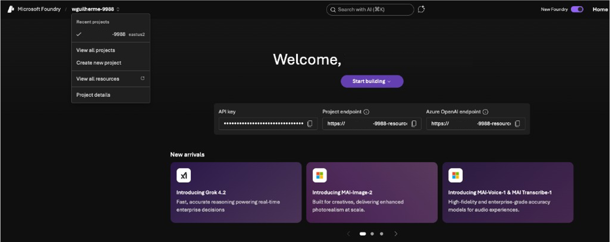
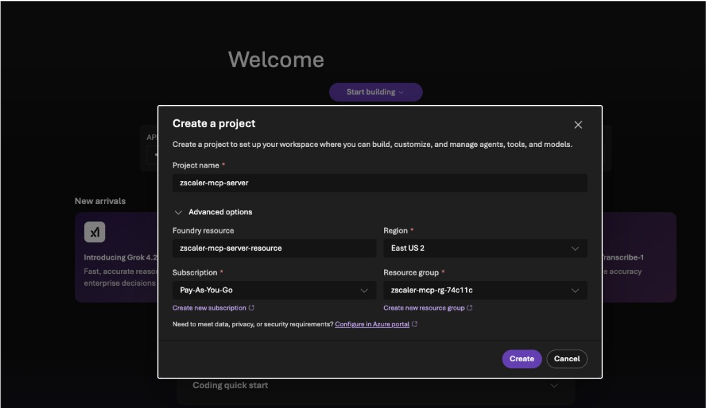
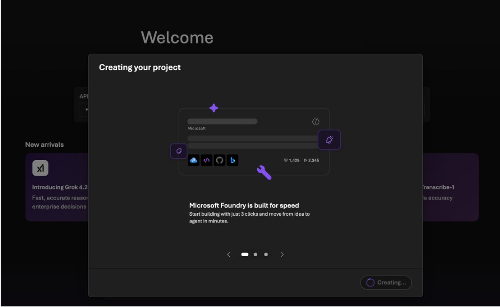
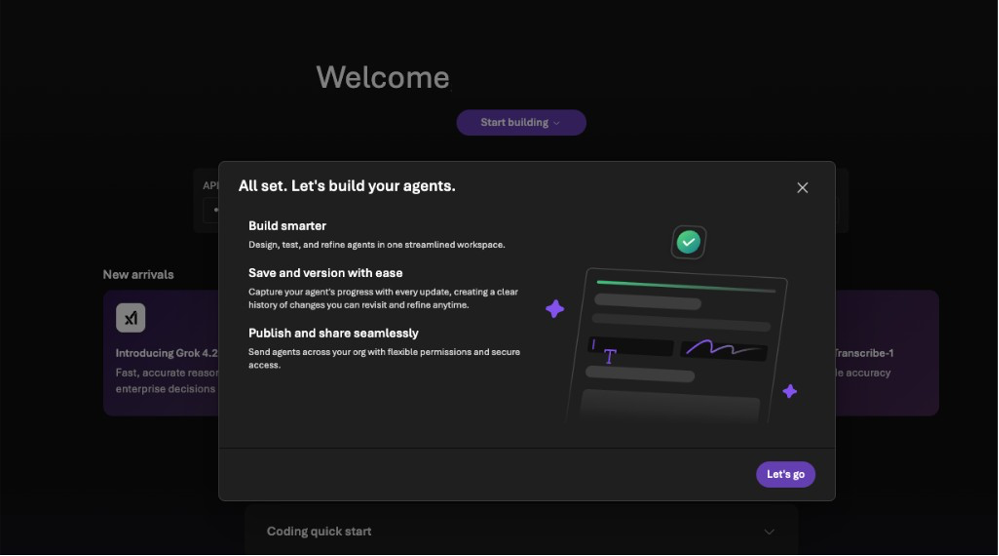
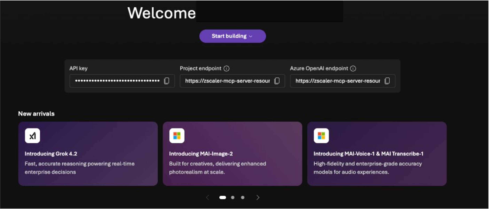
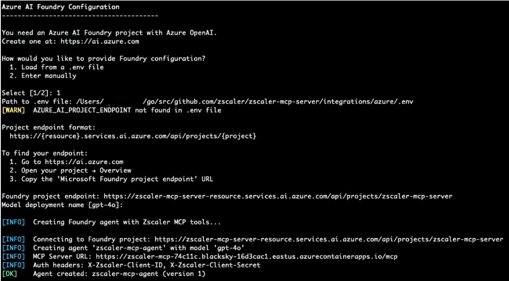

# Azure AI Foundry Integration

This guide covers integrating the Zscaler MCP Server with [Azure AI Foundry](https://ai.azure.com) to create autonomous security agents powered by GPT-4o (or GPT-4) that can call 300+ Zscaler tools.

There are two ways to configure the Foundry agent:

| Method | Description | Best For |
|--------|-------------|----------|
| **API (CLI)** | Create and manage the agent via `azure_mcp_operations.py` commands | Automation, CI/CD, scripted deployments |
| **UI (Portal)** | Configure the agent through the Azure AI Foundry portal | Visual setup, exploring capabilities |

Both methods result in the same Foundry agent — they differ only in how you create and manage it.

## Architecture

```
┌─────────────┐     ┌──────────────────────┐     ┌─────────────────────┐     ┌───────────────────┐
│  User / CLI │────▶│  Azure AI Foundry     │────▶│  Zscaler MCP Server │────▶│  Zscaler APIs     │
│  or Portal  │     │  (GPT-4o Agent)       │     │  (Container App/VM) │     │  (ZPA/ZIA/ZDX...) │
└─────────────┘     └──────────────────────┘     └─────────────────────┘     └───────────────────┘
                    Uses MCPTool to discover       Exposes 300+ tools via      Zero Trust Exchange
                    and call Zscaler tools         streamable-http transport
```

**Data flow:**
1. You send a natural language request (e.g., "List my ZPA application segments")
2. Azure AI Foundry's GPT-4o interprets the request and selects the right MCP tool
3. Foundry calls your deployed MCP server via the `MCPTool` integration
4. The MCP server authenticates to the Zscaler API and returns results
5. GPT-4o formats the response and presents it to you

## Prerequisites

Before setting up the Foundry agent, you need:

1. **A deployed Zscaler MCP Server** — Deploy via Container Apps or VM first:
   ```bash
   cd integrations/azure
   python azure_mcp_operations.py deploy
   ```
   This gives you a public MCP URL (e.g., `https://zscaler-mcp-xxx.azurecontainerapps.io/mcp`).

2. **An Azure AI Foundry project** — See [Creating a Foundry Project](#creating-a-foundry-project) below.

3. **Azure CLI authenticated** — `az login`

4. **Python packages** — Installed automatically when needed, or manually:
   ```bash
   pip install azure-ai-projects azure-identity
   ```

5. **Environment variables** (in your `integrations/azure/.env` file):
   ```env
   AZURE_AI_PROJECT_ENDPOINT=https://<resource>.services.ai.azure.com/api/projects/<project>
   AZURE_OPENAI_MODEL=gpt-4o
   ```

## Creating a Foundry Project

If you don't already have an Azure AI Foundry project, follow these steps:

### 1. Open Azure AI Foundry

Go to [ai.azure.com](https://ai.azure.com). You'll see the Foundry home page with your recent projects (if any).



### 2. Create a New Project

Click **Create new project** from the left sidebar dropdown. Fill in:

- **Project name:** e.g., `zscaler-mcp-server`
- **Foundry resource:** Select an existing resource or create a new one (e.g., `zscaler-mcp-server-resource`)
- **Region:** Choose a region (e.g., `East US 2`)
- **Subscription:** Your Azure subscription
- **Resource group:** Select or create one (e.g., `zscaler-mcp-rg-74c11c`)

Click **Create**.



### 3. Wait for Project Creation

Foundry will take a few seconds to provision the project and its resources.



### 4. Project Ready

Once complete, you'll see a confirmation dialog — click **Let's go**.



### 5. Copy the Project Endpoint

The project overview page displays three key values:

- **API key** — Used for direct API access (not needed for the CLI method)
- **Project endpoint** — This is the `AZURE_AI_PROJECT_ENDPOINT` value you need
- **Azure OpenAI endpoint** — Used for direct OpenAI API access

Copy the **Project endpoint** URL. It looks like:
```
https://<resource>.services.ai.azure.com/api/projects/<project>
```



### 6. Add to Your .env File

Paste the endpoint into your `integrations/azure/.env` file:

```env
AZURE_AI_PROJECT_ENDPOINT=https://zscaler-mcp-server-resource.services.ai.azure.com/api/projects/zscaler-mcp-server
AZURE_OPENAI_MODEL=gpt-4o
```

When running `agent_create`, if this variable is set in the `.env` file, it is automatically detected and you won't be prompted for it.

## Method 1: API (CLI) Integration

The CLI method uses `azure_mcp_operations.py` subcommands to manage the agent lifecycle.

### Step 1: Deploy the MCP Server

If you haven't already:

```bash
cd integrations/azure
python azure_mcp_operations.py deploy
```

Follow the interactive prompts to select deployment target, auth mode, and credentials. Note the MCP URL printed at the end.

### Step 2: Create the Foundry Agent

```bash
python azure_mcp_operations.py agent_create
```

This command:
1. Reads the deployed MCP server URL and auth mode from the deployment state
2. Prompts for your Foundry project endpoint and model name (or reads from `.env`)
3. Builds authentication headers based on your MCP auth mode
4. Creates the agent in Azure AI Foundry with an `MCPTool` pointing to your MCP server

The script will prompt for Foundry configuration. You can load it from a `.env` file (option 1) or enter manually (option 2):

```
Azure AI Foundry Configuration
----------------------------------------

How would you like to provide Foundry configuration?
  1. Load from a .env file
  2. Enter manually

Select [1/2]: 1
Path to .env file: integrations/azure/.env
```

> **Tip:** If `AZURE_AI_PROJECT_ENDPOINT` is set in your `.env` file, it is automatically detected. Otherwise, you'll be prompted to paste the endpoint URL.

Once complete, the script displays a summary:



```
============================================================
  Foundry Agent Created
============================================================

  Agent Name:    zscaler-mcp-agent
  Version:       1
  Model:         gpt-4o
  MCP Server:    https://zscaler-mcp-xxx.azurecontainerapps.io/mcp

  Next steps:
    1. Start a chat session:
       python azure_mcp_operations.py agent_chat

    2. Or use the Foundry portal:
       https://zscaler-mcp-server-resource.services.ai.azure.com/projects/zscaler-mcp-server
```

### Step 3: Chat with the Agent

**Interactive session:**
```bash
python azure_mcp_operations.py agent_chat
```

**Single query:**
```bash
python azure_mcp_operations.py agent_chat -m "List all ZPA application segments"
```

The chat session features:
- Interactive multi-turn conversation
- MCP tool approval prompts (approve/deny each tool call)
- Per-response token usage tracking
- End-of-session summary (duration, messages, cumulative tokens)

**In-chat commands:**

| Command | Description |
|---------|-------------|
| `help` | Show available commands, usage tips, and example prompts |
| `status` | Show agent info, project endpoint, session duration, tokens, and messages sent |
| `clear` | Clear the terminal screen |
| `reset` | Reset the conversation context (clears response chain, token count, message count) |
| `quit` / `exit` / `q` | End the chat session and display a summary |

### Step 4: Manage the Agent

```bash
# Check agent status
python azure_mcp_operations.py agent_status

# Delete the agent
python azure_mcp_operations.py agent_destroy

# Delete without confirmation prompt
python azure_mcp_operations.py agent_destroy -y
```

### Authentication Between Foundry and MCP Server

The Foundry agent authenticates to the MCP server using custom HTTP headers passed via `MCPTool.headers`. The headers vary by auth mode:

| MCP Auth Mode | Headers Sent by Foundry |
|---------------|------------------------|
| **Zscaler** | `X-Zscaler-Client-ID` + `X-Zscaler-Client-Secret` |
| **API Key** | `X-MCP-API-Key` |
| **JWT / OIDCProxy** | Not directly supported — use API Key or Zscaler mode for Foundry |
| **None** | No headers |

> **Note:** Foundry blocks the standard `Authorization` header for security. The MCP server's custom header authentication (`X-Zscaler-Client-ID`, `X-MCP-API-Key`) works as a workaround. See `foundry_agent.py` docstring for details.

## Method 2: UI (Portal) Integration

You can also configure the Foundry agent through the Azure AI Foundry portal at [ai.azure.com](https://ai.azure.com).

### Step 1: Deploy the MCP Server

Same as Method 1 — you need a running MCP server with a public URL.

### Step 2: Open Your Foundry Project

1. Go to [ai.azure.com](https://ai.azure.com)
2. Open your project
3. Navigate to **Agents** in the left sidebar

### Step 3: Create an Agent

1. Click **+ New agent**
2. Configure the agent:
   - **Name:** `zscaler-mcp-agent`
   - **Model:** Select your GPT-4o deployment
   - **Instructions:** Paste the agent instructions (see below)
3. Under **Tools**, add an **MCP Tool**:
   - **Server URL:** Your deployed MCP server URL (e.g., `https://zscaler-mcp-xxx.azurecontainerapps.io/mcp`)
   - **Headers:** Add authentication headers based on your MCP auth mode (see table above)

### Step 4: Test in the Portal

Use the built-in chat interface in the Foundry portal to test the agent. Ask questions like:
- "What Zscaler services are available?"
- "List my ZPA application segments"
- "Show me ZIA firewall rules"

> **Note:** If you created the agent via the CLI (`agent_create`), it will also be visible in the Foundry portal under **Agents**. You can use the portal's chat interface to test it interactively.

### Agent Instructions

Use these instructions when creating the agent via the portal:

```
You are a Zscaler security assistant powered by the Zscaler MCP Server.

You have access to 300+ tools for managing the Zscaler Zero Trust Exchange:
- ZPA (Zscaler Private Access): Application segments, access policies, connectors
- ZIA (Zscaler Internet Access): Firewall rules, URL filtering, DLP, locations
- ZDX (Zscaler Digital Experience): Application health, device metrics, alerts
- ZCC (Zscaler Client Connector): Device enrollment, forwarding profiles
- ZTW (Zscaler Workload Segmentation): IP groups, network services
- EASM (External Attack Surface Management): Findings, lookalike domains
- ZIdentity: Users, groups, identity management
- Z-Insights: Web traffic analytics, cyber incidents, shadow IT

Always start by calling zscaler_get_available_services to discover which services
and tools are enabled on this server.

When asked to perform operations:
1. List/get the current state first
2. Confirm changes with the user before executing writes
3. For ZIA changes: remind the user to activate configuration after modifications
```

## CLI Command Reference

| Command | Description |
|---------|-------------|
| `python azure_mcp_operations.py deploy` | Deploy MCP server (Container Apps or VM) |
| `python azure_mcp_operations.py agent_create` | Create Foundry agent pointing to deployed MCP server |
| `python azure_mcp_operations.py agent_chat` | Start interactive chat session |
| `python azure_mcp_operations.py agent_chat -m "query"` | Send a single query |
| `python azure_mcp_operations.py agent_status` | Show agent status |
| `python azure_mcp_operations.py agent_destroy` | Delete the agent |
| `python azure_mcp_operations.py agent_destroy -y` | Delete without confirmation |
| `python azure_mcp_operations.py destroy` | Tear down all Azure resources |
| `python azure_mcp_operations.py status` | Show deployment status |
| `python azure_mcp_operations.py logs` | Stream container/VM logs |

## Environment Variables

| Variable | Required | Description |
|----------|----------|-------------|
| `AZURE_AI_PROJECT_ENDPOINT` | Yes | Foundry project endpoint URL |
| `AZURE_OPENAI_MODEL` | No | Model deployment name (default: `gpt-4o`) |
| `ZSCALER_CLIENT_ID` | Yes | Zscaler OneAPI client ID |
| `ZSCALER_CLIENT_SECRET` | Yes | Zscaler OneAPI client secret |
| `ZSCALER_VANITY_DOMAIN` | Yes | Zscaler vanity domain |
| `ZSCALER_CUSTOMER_ID` | Yes | Zscaler customer ID |
| `ZSCALER_CLOUD` | Yes | Zscaler cloud (e.g., `beta`, `production`) |

## Troubleshooting

### "No deployment found" when running agent_create

The Foundry agent requires a deployed MCP server. Run `deploy` first:
```bash
python azure_mcp_operations.py deploy
```

### Agent can't reach the MCP server

Verify the MCP server is running and accessible:
```bash
python azure_mcp_operations.py status
curl -s https://<your-mcp-url>/mcp | head -1
```

### "MCP approval requests do not have an approval" error

This happens when tool approval responses aren't properly chained. The CLI handles this automatically via `previous_response_id` tracking. If using the portal, ensure you approve tool calls in sequence.

### JWT/OIDCProxy auth modes with Foundry

Azure AI Foundry blocks the standard `Authorization` header in `MCPTool.headers`. If your MCP server uses JWT or OIDCProxy auth, consider:
1. Redeploying with `api-key` or `zscaler` auth mode
2. Or adding a reverse proxy that injects the auth token
