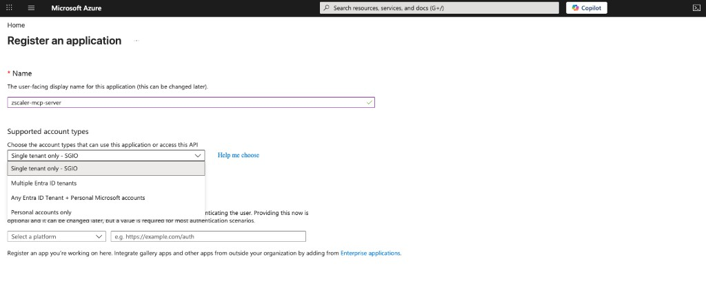
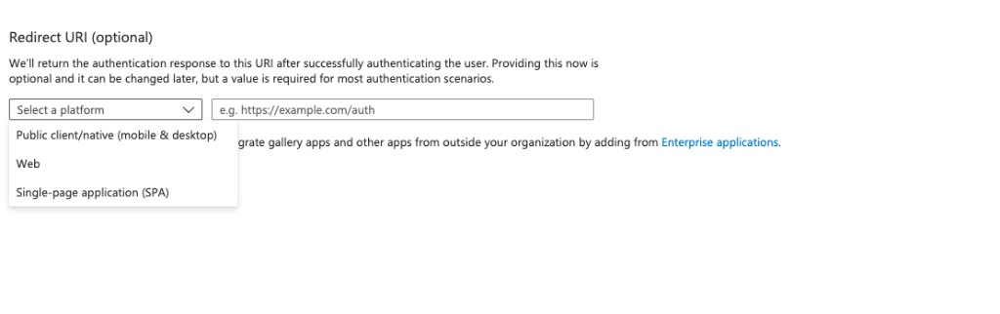
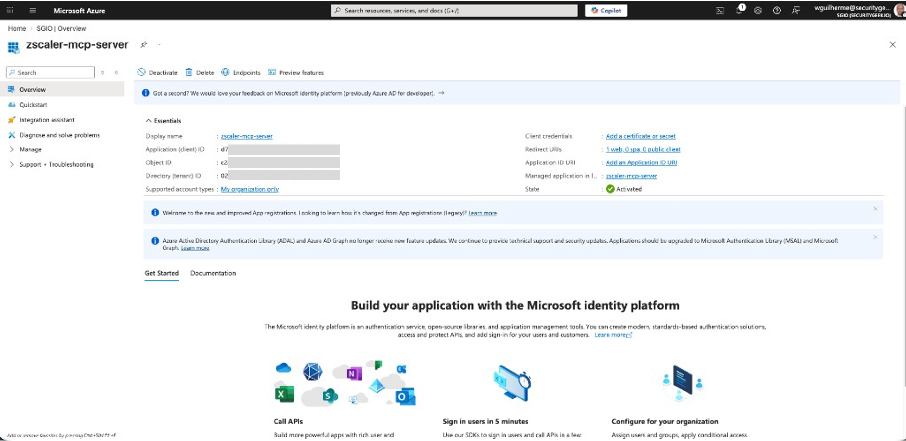
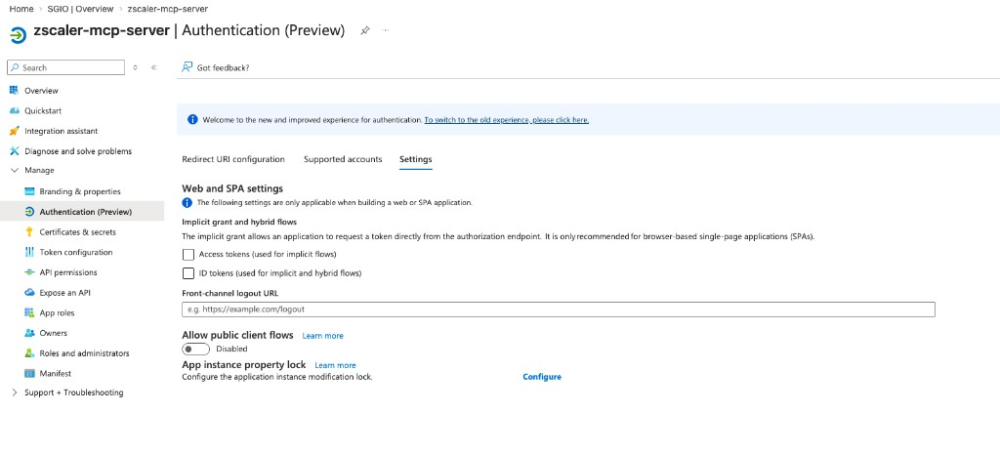
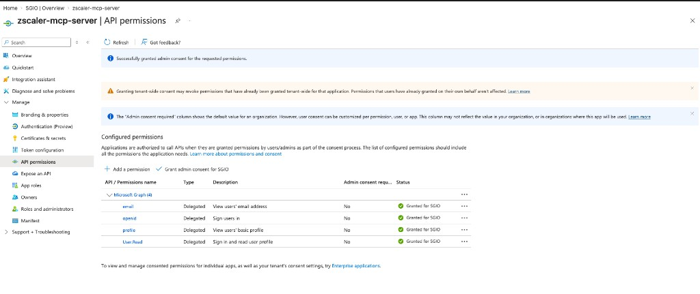
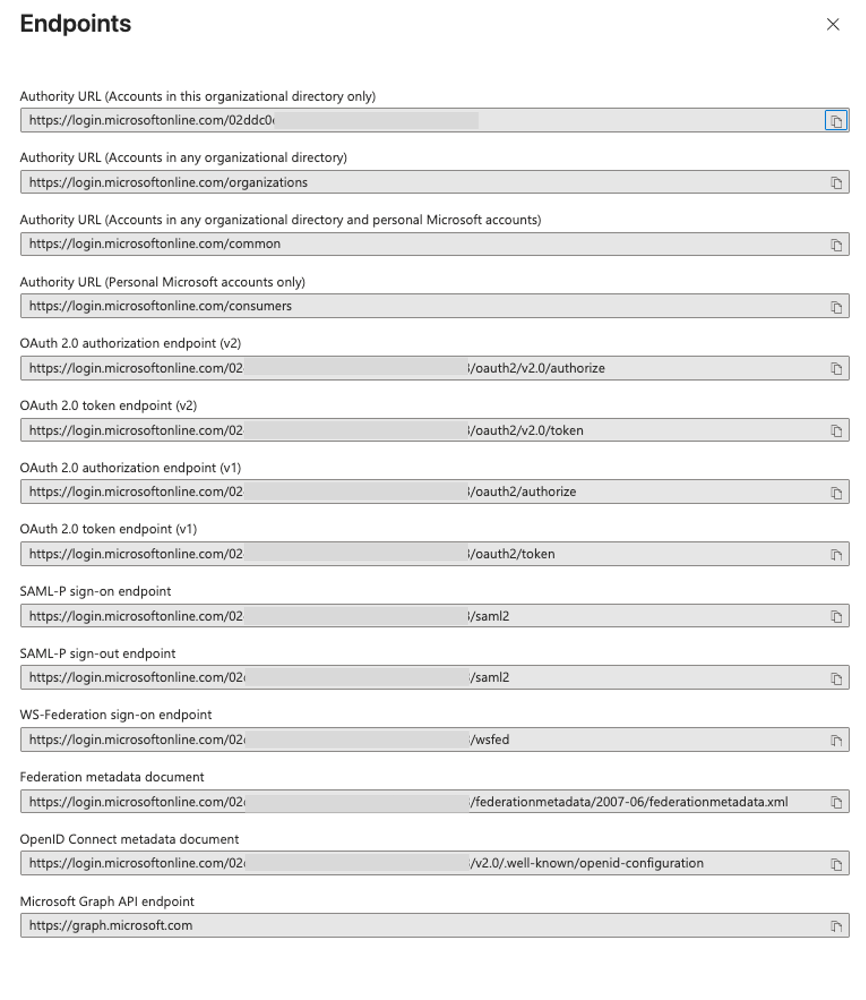

# OIDC Setup with Microsoft Entra ID

This guide walks you through configuring **Microsoft Entra ID** (formerly Azure AD) as the identity provider for the Zscaler MCP Server's `oidc` authentication mode. When complete, users will authenticate via their Microsoft account before accessing Zscaler MCP tools.

## Overview

In `oidc` mode the MCP server is an OAuth 2.0 **protected resource** ([RFC 9728](https://www.rfc-editor.org/rfc/rfc9728.html)). It issues no tokens and runs no login flow of its own — it publishes a small metadata document naming Entra ID as the authorization server, and verifies the tokens clients present. The flow works as follows:

1. User opens Claude Desktop / Cursor
2. The client gets a `401` from `/mcp` with a `WWW-Authenticate` header whose `resource_metadata` parameter names the metadata document
3. It reads that document and learns Entra ID is the authorization server, and which scope to request
4. A browser window opens with the Microsoft Entra ID sign-in page — the OAuth flow runs **directly against Entra ID**
5. The client retries `/mcp` with `Authorization: Bearer <token>`; the server verifies the signature, issuer, audience and expiry against Entra ID's public keys
6. The MCP client is authenticated and can call Zscaler tools

The same mechanism works with Auth0, Okta, Keycloak, or any OIDC-compliant provider — only the configuration differs. Entra ID gets its own guide because it diverges in three ways, each producing a different confusing failure:

| Divergence | Consequence if you follow a generic OIDC example | Fixed in |
|---|---|---|
| `aud` is the **client ID**, not a separate API identifier | 401 `invalid_token` | Step 8 |
| Entra ID issues **v1 access tokens by default**, whose `iss` doesn't match its own v2.0 discovery document | 401 `invalid_token` after a *successful* sign-in | [Step 5](#step-5-request-v2-access-tokens) |
| The OAuth `resource` identifier **must contain a path**, because Entra ID rejects any Application ID URI ending in a slash | `AADSTS9010010` before the sign-in page even renders | [Step 4](#step-4-expose-the-server-as-an-api) |

The last two are absolute — no client-side configuration works around either.

**The server holds no credential.** Verifying a signature requires Entra ID's public keys, not a secret of ours, so there is no client secret to create, store, or rotate for the MCP server.

## Prerequisites

- **Azure subscription** with access to Microsoft Entra ID
- **Global Administrator** or **Application Administrator** role (to create app registrations and grant admin consent)
- **Zscaler MCP Server** source code or installed package
- **Node.js** (for `npx mcp-remote`)

## Step 1: Create an App Registration

1. Go to the [Azure Portal](https://portal.azure.com)
2. Navigate to **Microsoft Entra ID** → **App registrations** → **+ New registration**

   

3. Fill in the registration form:

   | Field | Value |
   |-------|-------|
   | **Name** | `zscaler-mcp-server` |
   | **Supported account types** | "Accounts in this organizational directory only" (single tenant) |

4. Under **Redirect URI**:
   - **Platform**: Select **Mobile and desktop applications** (a public client)
   - **URI**: Enter `http://localhost:3334/oauth/callback`

   

5. Click **Register**
6. Go to **Authentication → Advanced settings** and set **Allow public client flows** to **Yes**, then **Save**

> **The redirect URI belongs to the MCP client, not to the MCP server.** The screenshot above shows the older value `http://localhost:8000/auth/callback` with platform **Web** — that was correct when the server itself was the OAuth client and handled the callback. It no longer is. The callback is now a loopback address the MCP client listens on. Register whatever URI **your client** uses — the value stays the same even when the server runs remotely.
>
> **You must pin `mcp-remote`'s port, or this URI will not match.** Despite what its README says, `mcp-remote` has no fixed default port: unless you pass one it derives the port from a hash of the server URL (`3335 + hash % 45816`), so it will not choose 3334. Entra ID compares `redirect_uri` byte-for-byte, so a derived port fails every login. Pass `3334` as the first argument after the server URL — as the [Step 9 config](#step-9-configure-claude-desktop) does — and the URI you registered above is the one it uses. An explicitly-passed port is used verbatim with no fallback, so it cannot drift between runs.

Verify both settings landed:

```bash
az rest --method GET \
  --uri "https://graph.microsoft.com/v1.0/applications(appId='<CLIENT_ID>')?\$select=publicClient,isFallbackPublicClient"
```

`publicClient.redirectUris` must contain `http://localhost:3334/oauth/callback`, and `isFallbackPublicClient` must be `true`.

## Step 2: Note Your Application IDs

After registration, you'll land on the app's **Overview** page:



Note down these two values:

| Field | Example |
|-------|---------|
| **Application (client) ID** | `00000000-1111-2222-3333-444444444444` |
| **Directory (tenant) ID** | `00000000-1111-2222-3333-444444444444` |

You can also find your tenant ID via the Azure CLI:

```bash
az account show --query tenantId -o tsv
```

> **The Directory (tenant) ID is not your Subscription ID.** Both are GUIDs shown on adjacent portal blades, and a Subscription ID in the discovery URL fails at server startup with `AADSTS90002: Tenant '<guid>' not found`. The `az` command above always returns the right one. The **Secret ID** on the *Certificates & secrets* blade is also not the client ID.
>
> **No client secret needed.** Earlier versions of this guide had you create one under **Certificates & secrets**. The server no longer uses it — token verification needs Entra ID's public keys, not a credential of ours. If you created one for a previous deployment, you can delete it.

## Step 3: Enable ID Tokens

1. Go to **Authentication (Preview)** in the left sidebar
2. Click the **Settings** tab
3. Under **Implicit grant and hybrid flows**, check: **ID tokens (used for implicit and hybrid flows)**
4. Click **Save**



> This is not required by the authorization-code-with-PKCE flow this guide uses, which never requests an ID token from the authorization endpoint. It is harmless to enable, and some other tooling expects it, so the step is kept for continuity.

## Step 4: Expose the Server as an API

**This step is mandatory and is the one most often missed.** Entra ID only mints an access token whose audience is your application if the client requests a scope belonging to your application. That requires an Application ID URI and at least one delegated scope.

Go to **App registrations → your app → Expose an API**.

1. **Application ID URI** → **Add** → replace the suggested `api://<CLIENT_ID>` with your server's **full MCP endpoint URL**:

   ```text
   https://your-mcp-server.example.com/mcp
   ```

   For local development that is `http://localhost:8000/mcp`.

2. **Add a scope**:

   | Field | Value |
   |-------|-------|
   | **Scope name** | `mcp.access` |
   | **Who can consent** | Admins and users |
   | **Admin consent display name** | `Access the Zscaler MCP server` |
   | **Admin consent description** | `Allows the signed-in user to call the Zscaler MCP server.` |
   | **State** | Enabled |

The scope's fully-qualified name is the App ID URI and the scope name joined by a slash. This is the value the client must request, and it appears again in [Step 9](#step-9-configure-claude-desktop):

```text
https://your-mcp-server.example.com/mcp/mcp.access
```

> **The Application ID URI must include the path, and must not end in a slash.** Both halves matter.
>
> The client sends the resource identifier from the server's metadata document as the OAuth `resource` parameter, serialized through the WHATWG URL parser. That parser normalizes a bare origin by appending a slash — `https://host` becomes `https://host/`. Entra ID compares `resource` byte-for-byte against your registered Application ID URIs and rejects the mismatch with `AADSTS9010010`, while *also* refusing to let you register the slashed form (`IdentifierUrisEndsWithSlash: ValueCannotEndWithSlash`). A bare origin is therefore unusable as a resource identifier on Entra ID.
>
> A URI that already has a path is left untouched by the parser: `https://host/mcp` stays `https://host/mcp`. That is the whole reason the resource identifier is the full MCP endpoint URL rather than the server's origin.

Equivalent CLI:

```bash
# 1. Application ID URI
az rest --method PATCH \
  --uri "https://graph.microsoft.com/v1.0/applications(appId='<CLIENT_ID>')" \
  --headers 'Content-Type=application/json' \
  --body '{"identifierUris":["https://your-mcp-server.example.com/mcp"]}'

# 2. Delegated scope
az rest --method PATCH \
  --uri "https://graph.microsoft.com/v1.0/applications(appId='<CLIENT_ID>')" \
  --headers 'Content-Type=application/json' \
  --body '{"api":{"oauth2PermissionScopes":[{
     "id":"'"$(uuidgen | tr 'A-Z' 'a-z')"'",
     "value":"mcp.access","type":"User","isEnabled":true,
     "adminConsentDisplayName":"Access the Zscaler MCP server",
     "adminConsentDescription":"Allows the signed-in user to call the Zscaler MCP server.",
     "userConsentDisplayName":"Access the Zscaler MCP server",
     "userConsentDescription":"Allows you to call the Zscaler MCP server."}]}}'
```

## Step 5: Request v2 Access Tokens

Entra ID's `requestedAccessTokenVersion` defaults to `null`, which means **v1**. A v1 access token carries:

```text
iss: https://sts.windows.net/<TENANT_ID>/
```

but the server reads its expected issuer from the v2.0 discovery document, which publishes:

```text
iss: https://login.microsoftonline.com/<TENANT_ID>/v2.0
```

The mismatch rejects every token with `401 invalid_token` even though the browser sign-in succeeded. The server is right to reject it — accepting an issuer other than the one its advertised authorization server publishes would defeat the check.

Go to **App registrations → your app → Manifest** and set:

```json
{ "api": { "requestedAccessTokenVersion": 2 } }
```

In the older AAD manifest view the same setting appears as a top-level `"accessTokenAcceptedVersion": 2`.

Or via CLI:

```bash
az rest --method PATCH \
  --uri "https://graph.microsoft.com/v1.0/applications(appId='<CLIENT_ID>')" \
  --headers 'Content-Type=application/json' \
  --body '{"api":{"requestedAccessTokenVersion":2}}'
```

> Entra ID refuses this change while the Application ID URI uses the legacy `https://<tenant>/<app>` form. Do [Step 4](#step-4-expose-the-server-as-an-api) first, then apply the token version.
>
> **With `requestedAccessTokenVersion: 2`, `aud` is the client ID GUID** — *not* the Application ID URI, even though the client requested a scope named after that URI. This is why the server's expected audience stays the client ID (Step 8), and it is the first divergence listed in the Overview.

## Step 6: Configure API Permissions

1. Go to **API permissions** in the left sidebar
2. Click **+ Add a permission** → **Microsoft Graph** → **Delegated permissions**
3. Search and add:
   - `openid`
   - `profile`
   - `email`
4. Click **Add permissions**
5. Click **Grant admin consent for [your organization]**



All four permissions (`User.Read`, `openid`, `profile`, `email`) should show green checkmarks under the **Status** column.

> These Graph permissions are conventional but they are **not** what authorizes the MCP call — the scope from [Step 4](#step-4-expose-the-server-as-an-api) is. A client that requests only `openid profile email` receives a *Microsoft Graph* token, whose `aud` is Graph rather than your app, and the server correctly rejects it.

## Step 7: Verify Endpoints

Click **Endpoints** in the top bar of your app registration to view the OIDC endpoints:



The key URL you need is the **OpenID Connect metadata document**:

```text
https://login.microsoftonline.com/{tenant-id}/v2.0/.well-known/openid-configuration
```

You can verify it works:

```bash
curl -s "https://login.microsoftonline.com/{tenant-id}/v2.0/.well-known/openid-configuration" | head -1
```

## Step 8: Run the MCP Server

No extra packages and no wrapper script — `oidc` mode is configured with environment variables and uses the normal entrypoint.

```bash
# .env
ZSCALER_MCP_AUTH_ENABLED=true
ZSCALER_MCP_AUTH_MODE=oidc

OIDCPROXY_CONFIG_URL=https://login.microsoftonline.com/<tenant-id>/v2.0/.well-known/openid-configuration
OIDCPROXY_CLIENT_ID=<app-client-id>

# MUST include the MCP path, and MUST equal the Application ID URI from Step 4.
OIDCPROXY_BASE_URL=http://localhost:8000/mcp

ZSCALER_MCP_ALLOW_HTTP=true          # local development only, no TLS
```

```bash
zscaler-mcp --transport streamable-http --host 0.0.0.0 --port 8000
```

> **`OIDCPROXY_BASE_URL` must carry the `/mcp` path on Entra ID.** It is the OAuth resource identifier clients send, and a bare origin cannot be registered as an Application ID URI — see the trailing-slash explanation in [Step 4](#step-4-expose-the-server-as-an-api). On other IdPs the origin is fine; on Entra ID it never works.
>
> Adding the path also moves the metadata document, by design: it is published at `/.well-known/oauth-protected-resource/mcp` instead of `/.well-known/oauth-protected-resource`. Clients find it either way — they probe the path-suffixed form first, and the 401 challenge names the exact URL in `resource_metadata`.
>
> **Do not set `OIDCPROXY_REQUIRED_SCOPES` on Entra ID.** That variable does double duty: it is published as `scopes_supported` in the metadata document *and* enforced against the token by exact string match. Entra ID advertises the fully-qualified `http://localhost:8000/mcp/mcp.access` but issues `scp: "mcp.access"` — the short name only. Setting it gets a user past sign-in and then fails the call with `403 insufficient_scope`. Supply the scope from the client instead ([Step 9](#step-9-configure-claude-desktop)).
>
> **Note:** `OIDCPROXY_AUDIENCE` defaults to `OIDCPROXY_CLIENT_ID`, which is exactly right for Entra ID — v2 tokens set `aud` to the app's client ID rather than to a separate API identifier or to the Application ID URI. You only need to set it explicitly on IdPs that use an API identifier, like Auth0.

The variables keep their `OIDCPROXY_` prefix so existing deployments keep working. `OIDCPROXY_CLIENT_SECRET` is ignored if present.

Confirm the server is publishing Entra ID as the authorization server — note the path suffix:

```bash
curl -s http://localhost:8000/.well-known/oauth-protected-resource/mcp | jq
```

```json
{
  "resource": "http://localhost:8000/mcp",
  "authorization_servers": [
    "https://login.microsoftonline.com/<tenant-id>/v2.0"
  ],
  "bearer_methods_supported": ["header"]
}
```

The startup log states exactly what the server will accept, which is the fastest way to diagnose a token rejection later:

```text
OIDC auth configured as a protected resource (issuer=…, resource=http://localhost:8000/mcp, audience=<app-client-id>)
```

## Step 9: Configure Claude Desktop

Update your Claude Desktop config:

**macOS:** `~/Library/Application Support/Claude/claude_desktop_config.json`
**Windows:** `%APPDATA%\Claude\claude_desktop_config.json`
**Linux:** `~/.config/Claude/claude_desktop_config.json`

```json
{
  "mcpServers": {
    "zscaler-mcp-server": {
      "command": "npx",
      "args": [
        "-y", "mcp-remote", "http://localhost:8000/mcp", "3334",
        "--static-oauth-client-info", "{\"client_id\":\"<app-client-id>\"}",
        "--static-oauth-client-metadata", "{\"scope\":\"http://localhost:8000/mcp/mcp.access\"}"
      ]
    }
  }
}
```

No `--header` flag needed — `mcp-remote` discovers the metadata document and runs the OAuth flow against Entra ID via the browser. Three arguments are doing load-bearing work, and the flow fails without any one of them:

- **`"3334"`** pins the OAuth callback port, and **must be the first argument after the URL.** `mcp-remote` reads the port from that exact position; anything else there (a flag, for example) is parsed as a port, silently yields `NaN`, and it falls back to a port derived from a hash of the server URL. There is no warning — the only symptom is Entra ID rejecting a `redirect_uri` you never chose. This is why the port comes before the flags rather than after.
- **`--static-oauth-client-info`** supplies the client ID from Step 2. Entra ID does not support Dynamic Client Registration, so a client that tries to register itself gets an error the bridge reports only as `ServerError`.
- **`--static-oauth-client-metadata`** supplies the **scope** from [Step 4](#step-4-expose-the-server-as-an-api). `mcp-remote` resolves the scope in the order *static client metadata → the `WWW-Authenticate` header → `scopes_supported` from the metadata document*, so this is the highest-priority source and the only one available here (the server deliberately advertises no `scopes_supported`, per Step 8). Without it, the client requests generic scopes such as `openid profile offline_access`, which don't name your resource, and Entra ID fails the authorize request with `AADSTS9010010`.

Cursor (`~/.cursor/mcp.json`) uses the same `mcp-remote` invocation.

> **Clear the cache after any change.** `mcp-remote` caches OAuth state per server URL under `~/.mcp-auth`. After changing anything in this guide, run `rm -rf ~/.mcp-auth && pkill -f mcp-remote` before retrying, or the client replays the old configuration and you'll debug a failure that no longer exists.

## Step 10: Test the Connection

1. Start the MCP server (Step 8)
2. Open Claude Desktop
3. A browser window will open with the Microsoft sign-in page
4. Sign in with your organizational account
5. Accept the consent prompt for **Access the Zscaler MCP server** (first time only)
6. Claude Desktop is now connected and authenticated

A successful flow looks like this in the server log — a 401 challenge, metadata discovery, then authenticated traffic. Note that the token exchange happens between the client and Entra ID; the server only fetches the signing keys:

```text
"GET  /.well-known/oauth-protected-resource/mcp HTTP/1.1" 200 OK
"POST /mcp HTTP/1.1" 401 Unauthorized
"GET  /.well-known/oauth-protected-resource/mcp HTTP/1.1" 200 OK
"POST /mcp HTTP/1.1" 200 OK
```

To confirm the Entra side without launching a browser, all four values below must be as shown:

```bash
az rest --method GET \
  --uri "https://graph.microsoft.com/v1.0/applications(appId='<CLIENT_ID>')?\$select=identifierUris,api,publicClient,isFallbackPublicClient"
```

| Property | Required value |
|---|---|
| `identifierUris` | `["http://localhost:8000/mcp"]` — has a path, no trailing slash |
| `api.requestedAccessTokenVersion` | `2` |
| `api.oauth2PermissionScopes[].value` | `mcp.access` |
| `publicClient.redirectUris` | `["http://localhost:3334/oauth/callback"]` |
| `isFallbackPublicClient` | `true` |

## Configuration Reference

### Entra ID vs Auth0 Comparison

| Setting | Auth0 | Entra ID |
|---------|-------|----------|
| `OIDCPROXY_CONFIG_URL` | `https://{domain}.auth0.com/.well-known/openid-configuration` | `https://login.microsoftonline.com/{tenant-id}/v2.0/.well-known/openid-configuration` |
| `OIDCPROXY_CLIENT_ID` | Auth0 Application Client ID | Entra App Registration Client ID |
| `OIDCPROXY_AUDIENCE` | API Identifier (e.g., `zscaler-mcp-server`) — must be set explicitly | **Client ID** (Entra v2 uses client_id as `aud`) — can be omitted, it defaults to the client ID |
| `OIDCPROXY_BASE_URL` | The server's origin is fine | **Must include the MCP path** (`https://host/mcp`) and match the Application ID URI |
| Resource / API registration | Create an API with an identifier | **Required**: Application ID URI = the full MCP endpoint URL, plus a delegated scope |
| Access token version | n/a | **Must set `requestedAccessTokenVersion: 2`** or the issuer won't match |
| Client secret | Not needed | Not needed |
| Callback URL | Belongs to the client — `http://localhost:3334/oauth/callback` once `mcp-remote` is pinned to that port | Same |
| Dynamic Client Registration | Supported | Not supported — pass the client ID with `--static-oauth-client-info` |
| Client scope configuration | Discovered automatically | **Must pass `--static-oauth-client-metadata`** with the fully-qualified scope |
| Admin consent | Not required | Required for organizational access |

### Environment Variable Mapping

| Variable | Source |
|----------|--------|
| `OIDCPROXY_CONFIG_URL` | Endpoints page → OpenID Connect metadata document |
| `OIDCPROXY_CLIENT_ID` | Overview page → Application (client) ID |
| `OIDCPROXY_BASE_URL` | Your MCP server's **full endpoint URL including the path** (e.g. `http://localhost:8000/mcp`), identical to the Application ID URI from Step 4 |
| `OIDCPROXY_AUDIENCE` | Optional for Entra ID — defaults to `OIDCPROXY_CLIENT_ID` |
| `OIDCPROXY_REQUIRED_SCOPES` | **Leave unset on Entra ID** — see Step 8 |

### Entra ID Object Reference

Everything that must exist on the app registration, and why:

| Property | Value | Why |
|---|---|---|
| `publicClient.redirectUris` | `http://localhost:3334/oauth/callback` | Where the client receives the authorization code. Matched byte-for-byte. |
| `isFallbackPublicClient` | `true` | "Allow public client flows" — the client holds no secret. |
| `identifierUris` | The full MCP endpoint URL, e.g. `http://localhost:8000/mcp` | Entra matches the OAuth `resource` parameter against this. Must have a path; cannot end in `/`. |
| `api.oauth2PermissionScopes` | one scope, `value: mcp.access` | Gives the client something to request that resolves to *your* app, so `aud` is your app and not Microsoft Graph. |
| `api.requestedAccessTokenVersion` | `2` | Makes `iss` match the v2.0 discovery document the server reads. |

## Remote Deployment

For Azure VM or Container Apps deployments:

1. **Base URL**: Set `OIDCPROXY_BASE_URL` to the public MCP endpoint of the deployment, **including the path** (e.g. `https://<FQDN>/mcp`). This is the OAuth resource identifier clients send, so it must match both the URL they connect to and the Application ID URI registered in Step 4.
2. **Application ID URI**: Update it to the deployment URL as well. It and `OIDCPROXY_BASE_URL` must stay byte-identical, so moving the server means changing both. An app registration can hold several `identifierUris`, so a local and a deployed URL can coexist during a migration — but none of them may end in a slash.
3. **Client scope**: Update the `--static-oauth-client-metadata` scope in the client config to the new URI, e.g. `https://<FQDN>/mcp/mcp.access`.
4. **Redirect URI**: Unchanged. The callback belongs to the MCP client, which still runs on the user's machine, so it stays a `localhost` URI no matter where the server lives. This is a simplification over the old proxy design, which needed a new redirect URI registered for every deployment URL.
5. Use the Azure deployment script and select the OIDC auth mode:

```bash
cd integrations/azure
python azure_mcp_operations.py deploy
# Select OIDC → provide the Entra ID config URL and client ID
```

The deployment script reads the configuration from the `.env` file:

```env
OIDCPROXY_DOMAIN=login.microsoftonline.com/<tenant-id>/v2.0
OIDCPROXY_CLIENT_ID=<app-client-id>
OIDCPROXY_AUDIENCE=<app-client-id>
```

> **Note:** `OIDCPROXY_DOMAIN` is used to construct the OpenID Connect discovery URL as `https://{OIDCPROXY_DOMAIN}/.well-known/openid-configuration`. These variables work with any OIDC provider (Entra ID, Okta, Auth0, Keycloak, etc.).

## Troubleshooting

### `AADSTS9010010: The resource parameter provided in the request doesn't match with the requested scopes`

This appears on the callback URL **before** any sign-in page renders, as `error=invalid_target`.

**Cause:** the `resource` value the client sent is not a registered Application ID URI, or the scope it requested doesn't belong to that resource.

**Fix — in order of likelihood:**

1. `OIDCPROXY_BASE_URL` is a bare origin (`http://localhost:8000`). The client normalizes it to `http://localhost:8000/` with a trailing slash, which Entra ID will never match and will never let you register. Set it to the full `/mcp` URL and register that as the Application ID URI ([Step 4](#step-4-expose-the-server-as-an-api)).
2. The client config is missing `--static-oauth-client-metadata`, so it requested generic scopes that don't name your resource ([Step 9](#step-9-configure-claude-desktop)).
3. The Application ID URI and `OIDCPROXY_BASE_URL` differ. They must be byte-identical.

Confirm what the server advertises, and that it has no trailing slash:

```bash
curl -s http://localhost:8000/.well-known/oauth-protected-resource/mcp | jq -r .resource
az rest --method GET \
  --uri "https://graph.microsoft.com/v1.0/applications(appId='<CLIENT_ID>')?\$select=identifierUris" \
  --query 'identifierUris' -o tsv
```

The two must print the same string.

### `IdentifierUrisEndsWithSlash` / `ValueCannotEndWithSlash`

**Cause:** you tried to register an Application ID URI ending in `/` — usually while chasing the error above.

**Fix:** Entra ID never accepts one. Use the un-slashed `…/mcp` form. This constraint is precisely why the resource identifier needs a path rather than being a bare origin.

### `401 invalid_token` after signing in successfully, with `iss` starting `https://sts.windows.net/`

**Cause:** the app is still issuing v1 access tokens.

**Fix:** set `requestedAccessTokenVersion` to `2` ([Step 5](#step-5-request-v2-access-tokens)). Verify:

```bash
az rest --method GET \
  --uri "https://graph.microsoft.com/v1.0/applications(appId='<CLIENT_ID>')?\$select=api" \
  --query 'api.requestedAccessTokenVersion'
```

### `401 invalid_token` after signing in successfully, with an unexpected `aud`

**Cause:** if `aud` is `00000003-0000-0000-c000-000000000000`, that's Microsoft Graph — the client requested only generic scopes, so Entra ID issued a Graph token.

**Fix:** supply your own scope via `--static-oauth-client-metadata` ([Step 9](#step-9-configure-claude-desktop)).

Otherwise compare the startup log line with the token the client received:

```text
OIDC auth configured as a protected resource (issuer=…, resource=…, audience=…)
```

Decode the token (e.g. at [jwt.ms](https://jwt.ms)) and check that `aud` equals your Application (client) ID and `iss` equals `https://login.microsoftonline.com/{tenant-id}/v2.0`. Entra ID's issuer is not a prefix of its discovery URL, which is why the server reads it from the discovery document rather than deriving it.

### `403 insufficient_scope`

**Cause:** `OIDCPROXY_REQUIRED_SCOPES` is set to the fully-qualified scope, but Entra ID puts only the short name in the token's `scp` claim, and the comparison is an exact string match.

**Fix:** unset `OIDCPROXY_REQUIRED_SCOPES` and pass the scope from the client instead ([Step 8](#step-8-run-the-mcp-server)).

### `AADSTS900144: The request body must contain the following parameter: 'scope'`

**Cause:** the client sent a `resource` parameter with no `scope`.

**Fix:** add `--static-oauth-client-metadata` with the fully-qualified scope ([Step 9](#step-9-configure-claude-desktop)).

### `AADSTS90002: Tenant '<guid>' not found`

**Cause:** a Subscription ID (or any other GUID) was used where the Directory (tenant) ID belongs.

**Fix:**

```bash
az account show --query tenantId -o tsv
```

### "Application with identifier was not found in the directory"

**Error:** `AADSTS700016: Application with identifier '{client-id}' was not found in the directory '{tenant}'.`

**Cause:** The client ID or tenant ID is incorrect.

**Fix:**

- Verify the Application (client) ID on the app registration Overview page
- Verify the tenant ID with `az account show --query tenantId -o tsv`
- Ensure the app is in the correct directory (tenant)

### "400 Bad Request" on OIDC Configuration URL

**Error:** `HTTPStatusError: Client error '400 Bad Request' for url 'https://login.microsoftonline.com/{tenant}/v2.0/.well-known/openid-configuration'`

**Cause:** Invalid tenant ID in the URL.

**Fix:** Verify your tenant ID:

```bash
az account show --query tenantId -o tsv
```

### `AADSTS50011: The redirect URI specified in the request does not match`

**Cause:** The URI your MCP client used is not registered on the app registration. The callback belongs to the client, so it is a `localhost` URI — not your server's address.

**Fix:** The error message names the `redirect_uri` Entra ID received. If its port is not the one you registered, `mcp-remote` is choosing its own: it has no fixed default and derives the port from a hash of the server URL. Pass `3334` as the **first argument after the URL** (see [Step 9](#step-9-configure-claude-desktop)) — in any other position it is ignored without a warning. Then confirm `http://localhost:3334/oauth/callback` is registered under **Authentication → Add a platform → Mobile and desktop applications**.

### "Consent required" or permissions error

**Cause:** Admin consent was not granted for the API permissions.

**Fix:** Go to API permissions → click "Grant admin consent for [organization]". Requires Global Administrator or Application Administrator role.

### Browser doesn't open for authentication

**Cause:** `mcp-remote` may not be triggering the OAuth flow.

**Fix:**

- Ensure the server is running and accessible at `http://localhost:8000`
- Verify Claude Desktop config points to `http://localhost:8000/mcp`
- `--allow-http` is not needed for a `localhost` URL — `mcp-remote` exempts loopback addresses. Add it only when pointing at a remote server over plain HTTP
- Open `http://localhost:8000/.well-known/oauth-protected-resource/mcp` in your browser — it should return JSON naming your Entra ID tenant. If it 404s, either the server is not running in `oidc` mode (check `ZSCALER_MCP_AUTH_MODE`) or `OIDCPROXY_BASE_URL` has no path, in which case the document is at `/.well-known/oauth-protected-resource` instead
- `/.well-known/oauth-authorization-server` and `/register` are *supposed* to 404 — this server is a protected resource, not an authorization server

### Login succeeds but the client keeps re-prompting, or an old error persists after a fix

**Cause:** stale `mcp-remote` OAuth cache. It is keyed per server URL and survives config edits.

**Fix:**

```bash
rm -rf ~/.mcp-auth
pkill -f mcp-remote
```

Then restart the MCP client.

### `Could not read the IdP's OpenID configuration from …`

**Cause:** The server could not fetch Entra ID's discovery document at startup — wrong tenant ID, or no network path from the host to `login.microsoftonline.com`.

**Fix:** Verify the URL with `curl`, and confirm egress to Entra ID is permitted from wherever the server runs.

### Non-secure cookies warning

**Message:** `WARNING: Using non-secure cookies for development; deploy with HTTPS for production.`

This is expected for `http://localhost` and safe for local development. For production, deploy with HTTPS (Container Apps provides this automatically).
